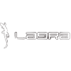

= LAGRA: A Go Logging Library

== Description

LAGRA is a Go logging library designed to be easy, efficient, fast, and lightweight with zero allocations. It offers advanced logging customization options and serves as an alternative to Zerolog and Logrus.

== Installation

To get started with LAGRA, you can add it to your Go project using `go get`:

[source,shell]
----
go get github.com/NervousGroove/LAGRA
----

== Usage Example

Here's a simple example of how to use LAGRA to log a message:

[source,go]
----
package main

import (
	"lagra"
)

func main() {
	// Create a new instance of Lagra
	logger := lagra.New()

	// Send an INFO log message
	infoLog := logger.send(lagra.Info)
	infoLog("This is an INFO log message")

	// Send a WARN log message
	warnLog := logger.send(lagra.Warn)
	warnLog("This is a WARN log message")

	// Send an ERROR log message
	errorLog := logger.send(lagra.Error)
	errorLog("This is an ERROR log message")

	// Save the log to a file
	logger.save()

	// Close the log file
	logger.Close()
}
----

== Features and Advantages

LAGRA offers several features and advantages that make it a solid choice for your Go logging needs:

1. *Easy to Use*: LAGRA is designed for simplicity. You can start logging with just a few lines of code.

2. *Efficiency and Zero Allocation*: LAGRA is resource-efficient and minimizes memory allocations, ensuring high performance.

3. *Log Levels*: It supports different log levels (debug, info, warning, error) so you can control the granularity of recorded messages.

4. *Customization*: You can customize the log message output format to suit different contexts and project requirements.

5. *Log Destinations*: In addition to printing logs to the console, LAGRA allows you to direct logs to different destinations, such as files, network outputs, or even third-party systems.

6. *Simple Configuration*: LAGRA's configuration is straightforward and human-readable, making log customization easy.

7. *Extensive Documentation*: The library comes with comprehensive documentation and usage examples to help you make the most of its features.

8. *Open Source License*: LAGRA is distributed under the MIT license, allowing you to use it in both commercial and open-source projects without restrictions.

9. *Active Community*: The Go developer community is active and ready to provide support and contributions to LAGRA.

LAGRA is a solid choice for those seeking an efficient, user-friendly, and highly customizable logging solution in Go.
